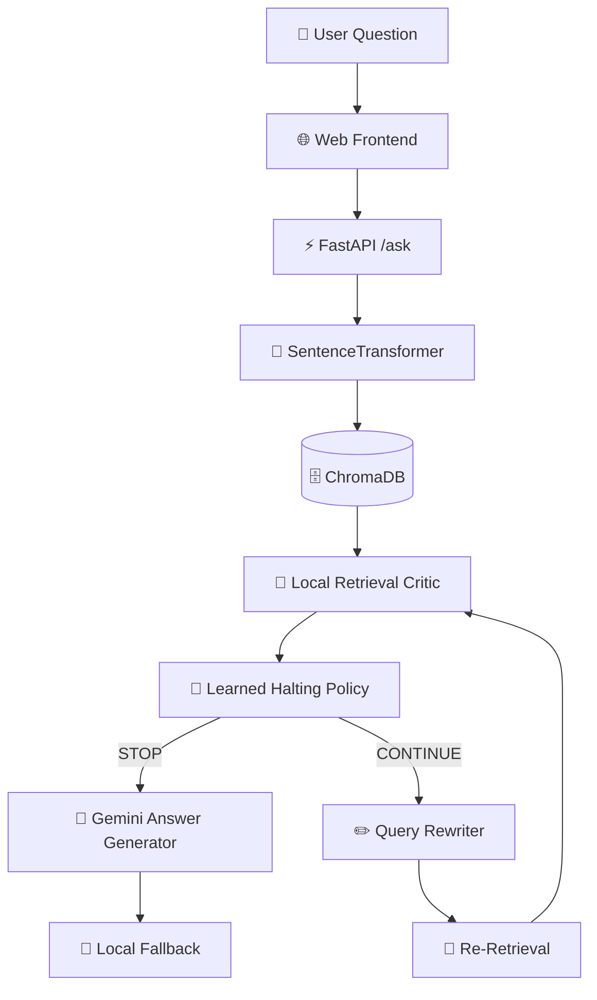

<div align="center">

# 🤖 Enterprise HR Knowledge Assistant

### Self-Correcting RAG with Learned Halting

<p align="center">
  <strong>An adaptive Retrieval-Augmented Generation system for answering HR policy questions with self-correction and learned stopping.</strong>
</p>

<p>
  
  
  
  
  
</p>

<p>
  
  
  
</p>

</div>

---

## ✨ Project Overview

**Enterprise HR Knowledge Assistant** is a Retrieval-Augmented Generation (RAG) system designed to answer HR policy questions from organizational policy documents.

Unlike a conventional fixed-retrieval RAG pipeline, this system can:

- 🔎 Retrieve relevant policy passages
- 🧠 Critically evaluate the retrieved context
- ✏️ Rewrite the query when retrieval is insufficient
- 🔁 Re-retrieve relevant information
- 🛑 Learn when to stop retrieving
- 💬 Generate a final natural-language answer
- 🧩 Fall back to a local answer when the external generation service is unavailable

The primary research corpus is based on the **VIT HR Conditions of Service / HR Manual 2019 Ver-005**.

---

## 🚀 Key Features

### 🔍 Semantic Retrieval

Uses:

- `SentenceTransformer`
- `all-MiniLM-L6-v2`
- `ChromaDB`
- Top-`k = 3` retrieval

The system converts the user question into an embedding and retrieves semantically related HR policy passages.

---

### 🧠 Local Retrieval Critic

A lightweight local critic evaluates whether the retrieved context is sufficiently relevant.

The current critic combines:

```text
Semantic Similarity
        +
Keyword Overlap
        |
        v
Relevance Score
```

Current decision threshold:

```text
score >= 0.75  →  SUFFICIENT
score <  0.75  →  INSUFFICIENT
```

This critic is used to guide the adaptive retrieval loop.

---

### ✏️ Query Rewriting

When the retrieved context is insufficient, the system rewrites the original question to improve retrieval.

Examples of HR topics handled by the query rewriter include:

- Casual Leave
- Medical Leave
- Maternity Leave
- Leave on Duty
- Sabbatical
- Compensatory Off
- Service Certificate
- Exit Interview
- Resignation
- Vacation / Long Leave

---

### 🛑 Learned Halting

Instead of always performing a fixed number of retrieval iterations, a learned classifier predicts whether the system should:

```text
STOP
  or
CONTINUE
```

The current VIT halting model uses **Logistic Regression** with:

```text
attempt
score
best_score
score_delta
```

`chunk_overlap` was removed from the final VIT model during feature ablation.

---

## 🏗️ System Architecture



---

## 🔄 Self-Correction Loop

The retrieval process follows an adaptive loop:

```text
User Question
      │
      ▼
Semantic Retrieval
      │
      ▼
Local Critic
      │
      ├──────────────► Sufficient
      │                     │
      │                     ▼
      │                   STOP
      │                     │
      │                     ▼
      │               Final Answer
      │
      ▼
Insufficient
      │
      ▼
Learned Halting Policy
      │
      ├────────► STOP
      │
      └────────► CONTINUE
                       │
                       ▼
                 Query Rewriting
                       │
                       ▼
                   Retrieval
                       │
                       ▼
                     Critic
```

---

# 📊 Research Evaluation

## 🧪 Evaluation Setup

### Primary Corpus

**VIT HR Conditions of Service**

```text
HR Manual 2019 Ver-005
```

### Secondary Corpus

**IIMA HR Policy Manual 2023**

### Preserved Baseline

**NexaCore Synthetic HR Policy Handbook**

The synthetic corpus and earlier experiments are preserved for historical comparison.

---

## 📚 100-Question Evaluation

The main experiment evaluates:

| Configuration | Description |
|---|---|
| Fixed-3 | Fixed retrieval policy |
| Learned Halting | Adaptive learned STOP/CONTINUE policy |

Evaluation size:

```text
100 questions
```

The evaluation uses grouped question-level methodology so trajectory rows belonging to the same original question are kept together during halting-policy evaluation.

---

## 📈 Main Results

| Metric | Fixed-3 | Learned Halting |
|---|---:|---:|
| Average retrieval attempts | **1.7600** | **1.3500** |
| Critic-defined success | **75.00%** | **75.00%** |
| Mean local-loop wall time | **0.1923 s** | **0.1463 s** |
| Median local-loop wall time | **0.2134 s** | **0.1147 s** |
| p95 local-loop wall time | **0.2386 s** | **0.2312 s** |
| Mean CPU time | **1.0897 s** | **0.8344 s** |

### Retrieval Work Reduction

```text
Fixed-3        : 1.7600 attempts
Learned        : 1.3500 attempts

Reduction      : 23.30%
```

The measured reduction is based on average retrieval attempts and is used as an **operational retrieval-work proxy**.

> ⚠️ This is not a monetary API-cost estimate.

---

## 🎯 Critic-Defined Success

```text
Fixed-3        : 75.00%
Learned        : 75.00%

Difference     : 0.00 percentage points
```

Important:

**Critic-defined success is not equivalent to independently verified answer-level accuracy.**

The critic score is a retrieval-quality proxy used by the adaptive retrieval system.

---

## ⚡ Local Retrieval-Loop Latency

Measured after embedding-model warm-up.

```text
Mean Wall Time

Fixed-3        0.1923 s
Learned        0.1463 s
```

Measured reduction:

```text
23.92%
```

CPU time:

```text
Fixed-3        1.0897 s
Learned        0.8344 s
```

Measured CPU-time reduction:

```text
23.43%
```

### ⚠️ Latency Scope

These measurements represent the:

```text
retrieval + critic + halting loop
```

They **exclude final Gemini answer-generation latency**.

Therefore these results should be interpreted as:

> **Local retrieval-loop latency**

rather than complete end-to-end user-visible latency.

---

# 📊 Pareto Analysis

A true stop-probability threshold sweep was performed to study the trade-off between:

```text
Retrieval Effort
       vs.
Critic-Defined Success
```

Generated research files:

```text
research/vit_v1/pareto_results_v2.csv
research/vit_v1/pareto_frontier_v2.csv
```

This allows different halting thresholds to be examined as operating points.

---

# 💰 API Cost Measurement

Gemini API usage logging has been implemented.

Log file:

```text
research/vit_v1/gemini_api_usage.csv
```

Tracked information includes:

- Input / prompt tokens
- Cached tokens
- Output tokens
- Thinking tokens
- Total tokens
- Estimated input cost
- Estimated output cost
- Estimated total cost
- API status
- Errors

### API Cost Limitation

A small matched Normal-RAG vs Learned-RAG monetary-cost pilot was attempted.

However, the external Gemini service repeatedly returned:

```text
503 / unavailable
```

The successful calls were therefore not sufficiently matched to support a defensible monetary-cost comparison.

### Research Policy

This project **does not claim a monetary API-cost reduction** from the pilot.

The API logging infrastructure is retained for future controlled experiments.

---

# 👨‍🔬 Human Validation

Human-validation materials were prepared for independent verification against the VIT source.

However:

```text
Full independent 100-question human validation
has NOT yet been completed.
```

Therefore the project keeps the following concepts separate:

```text
Critic-defined retrieval success
            ≠
Independent answer correctness
```

This distinction is important for interpreting the reported evaluation results.

---

# 📖 Corpus

## VIT HR Manual

Primary research source:

```text
documents/vit/
```

The current evaluation focuses on the VIT HR Conditions of Service document.

Topics represented in the corpus include areas such as:

- Casual Leave
- Medical Leave
- Maternity Leave
- Sabbatical
- Leave on Duty
- Compensatory Off
- Service Certificate
- Exit Interview
- Resignation
- Related HR policies

---

## IIMA HR Policy Manual

Secondary corpus:

```text
documents/IIM/
```

Used for broader testing and generalization experiments.

---

## Synthetic Baseline

Historical synthetic corpus:

```text
documents/synthetic/
```

The original synthetic dataset is preserved and should not be confused with the final VIT evaluation.

---

# 🧩 Technology Stack

| Layer | Technology |
|---|---|
| Language | Python |
| API | FastAPI |
| Server | Uvicorn |
| Embeddings | SentenceTransformers |
| Embedding Model | `all-MiniLM-L6-v2` |
| Vector Store | ChromaDB |
| Critic | Local semantic + keyword scoring |
| Query Rewriting | Local topic-aware rewriter |
| Halting Model | Logistic Regression |
| Final Answer | Gemini |
| Frontend | HTML / CSS / JavaScript |
| Research Analysis | Python / CSV |

---

# 📁 Project Structure

```text
hr-rag-assistant/
│
├── 📄 app.py
├── 📄 gemini_answer.py
├── 📄 halting_policy.py
├── 📄 local_critic.py
├── 📄 local_query_rewriter.py
├── 📄 local_self_correcting_rag.py
│
├── 📁 static/
│   └── 📄 index.html
│
├── 📁 documents/
│   ├── 📁 vit/
│   ├── 📁 IIM/
│   └── 📁 synthetic/
│
├── 📁 research/
│   └── 📁 vit_v1/
│       ├── 📁 questions/
│       │   └── evaluation_questions_100.txt
│       │
│       ├── advanced_research_analysis.py
│       ├── advanced_summary_v2.txt
│       ├── advanced_question_results_v2.csv
│       ├── pareto_results_v2.csv
│       ├── pareto_frontier_v2.csv
│       ├── evaluate_halting_cv.py
│       ├── train_halting_policy.py
│       └── halting_policy_vit_v3.pkl
│
├── 📄 PROJECT_SUMMARY.txt
├── 📄 README.md
└── 📄 .gitignore
```

---

# ⚙️ Quick Start

## 1️⃣ Clone the Repository

```bash
git clone https://github.com/yusufthecoder474/hr-self-correcting-rag.git
cd hr-self-correcting-rag
```

---

## 2️⃣ Create Virtual Environment

### Windows

```cmd
python -m venv venv
venv\Scripts\activate
```

---

## 3️⃣ Install Dependencies

```cmd
pip install -r requirements.txt
```

---

## 4️⃣ Configure Environment

Create a `.env` file containing your Gemini configuration.

```env
GEMINI_API_KEY=your_api_key_here
```

> 🔐 Never commit `.env` files or API keys to GitHub.

---

## 5️⃣ Start the Application

```cmd
uvicorn app:app --host 127.0.0.1 --port 8000 --reload
```

Open:

```text
http://127.0.0.1:8000
```

---

# 🌐 API

## Ask a Question

```http
POST /ask
```

The application accepts an HR policy question and runs the self-correcting retrieval pipeline.

---

## Health Check

```http
GET /health
```

---

## Interactive API Documentation

```text
http://127.0.0.1:8000/docs
```

FastAPI's Swagger interface can be used to test the API.

---

# 🖥️ Demo Questions

Try questions such as:

```text
How many days of Casual Leave are allowed in an academic year?
```

```text
What are the requirements for Medical Leave?
```

```text
What are the eligibility requirements for Maternity Leave?
```

```text
What are the requirements for Leave on Duty?
```

```text
What are the eligibility and duration requirements for Sabbatical Leave?
```

```text
What are the requirements for obtaining a Service Certificate?
```

The interface exposes the retrieval process and learned halting trajectory.

---

# 🔬 Research Reproducibility

The main analysis can be reproduced using:

```cmd
python research\vit_v1\advanced_research_analysis.py --questions-file "research\vit_v1\questions\evaluation_questions_100.txt"
```

The main result summary is stored in:

```text
research/vit_v1/advanced_summary_v2.txt
```

Question-level results:

```text
research/vit_v1/advanced_question_results_v2.csv
```

---

# 🛑 TASR Note

TASR is treated as related work rather than a reproduced baseline.

This project currently uses:

```text
SentenceTransformer Retrieval
        +
Local Retrieval Critic
        +
Query Rewriting
        +
Learned Logistic-Regression Halting
```

A faithful TASR reproduction is **not claimed**, because the present implementation does not expose the same calibrated LLM logit-based signal required for that method.

---

# ⚠️ Research Limitations

Current limitations include:

1. Critic-defined success is a retrieval proxy rather than independently verified answer-level accuracy.
2. Full independent human validation has not yet been completed for all 100 questions.
3. PDF extraction and chunking can sometimes introduce neighboring or unrelated policy text into retrieved context.
4. Gemini availability prevented a defensible matched monetary API-cost comparison.
5. Reported latency focuses on the local retrieval loop and excludes final Gemini generation.
6. A faithful TASR reproduction is not claimed.
7. Additional stopping-method baselines and broader independent evaluation would strengthen the study.

---

# 🧠 Research Contribution

The project investigates an adaptive RAG architecture where retrieval effort is controlled by a learned halting policy rather than relying exclusively on a fixed retrieval budget.

The current VIT evaluation demonstrates:

```text
23.30% lower average retrieval attempts
with
the same 75.00% critic-defined success rate
```

on the evaluated 100-question set.

The result should be interpreted as evidence of reduced retrieval effort under the project's critic-defined evaluation procedure, rather than as independent proof of answer accuracy.

---

# 🔐 Security

Please follow these practices:

- Never commit `.env`
- Never commit API keys
- Keep secrets on the server side
- Use authenticated APIs in production
- Validate user input
- Apply rate limiting
- Avoid exposing internal credentials
- Review uploaded documents before public repository distribution

---

# 🛠️ Development Notes

The repository contains some earlier development implementations retained for historical reference.

Examples include:

```text
critic.py
query_rewriter.py
self_correcting_rag.py
retrieve.py
```

The canonical application path is:

```text
app.py
  ↓
local_self_correcting_rag.py
  ↓
local_critic.py
  ↓
local_query_rewriter.py
  ↓
halting_policy.py
  ↓
gemini_answer.py
```

Earlier files should be treated as legacy/development artifacts until final repository cleanup is completed.

---

# 📌 Current Research Status

| Component | Status |
|---|---|
| Real VIT corpus | ✅ Completed |
| 100-question evaluation | ✅ Completed |
| Learned halting policy | ✅ Completed |
| Fixed-3 comparison | ✅ Completed |
| Latency analysis | ✅ Completed |
| CPU analysis | ✅ Completed |
| Operational work proxy | ✅ Completed |
| Pareto analysis | ✅ Completed |
| API usage logging | ✅ Completed |
| Matched API monetary-cost comparison | ⚠️ Not established |
| Full independent human validation | ⚠️ Not completed |
| Final repository cleanup | 🔄 Pending |

---

# 📜 License

This project is intended for academic and research use.

See the repository license file for the applicable terms.

---

# 🙏 Acknowledgements

This project builds upon the ecosystem of:

- 🤗 SentenceTransformers
- 🗄️ ChromaDB
- ⚡ FastAPI
- 🧠 Google Gemini
- 🐍 Python

Special thanks to the academic guidance and research feedback that supported the development and evaluation of this project.

---

<div align="center">

### 🤖 Enterprise HR Knowledge Assistant

**Self-Correcting RAG • Query Rewriting • Learned Halting • Adaptive Retrieval**

⭐ Star the repository if you find the research interesting.

</div>