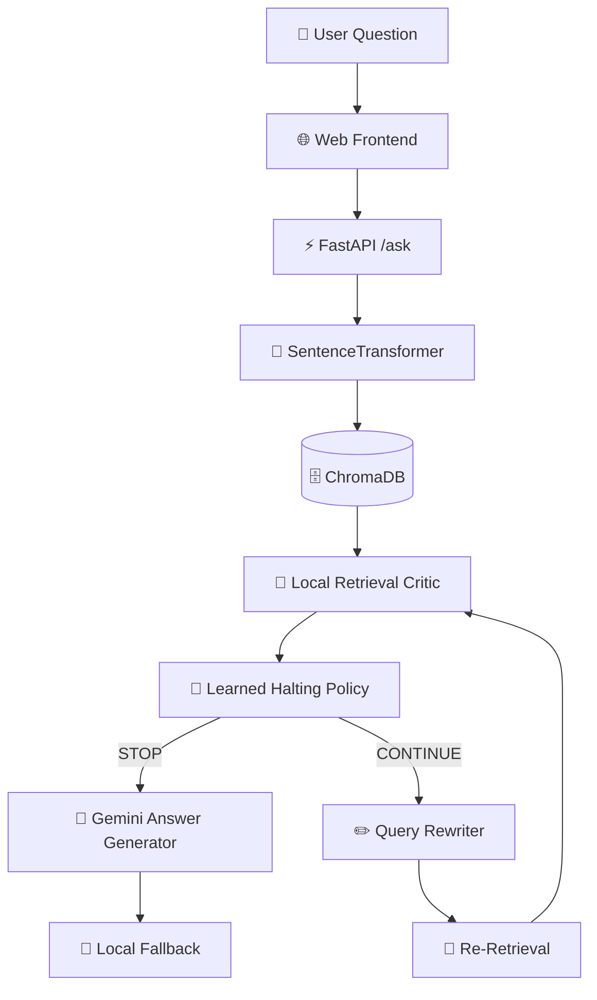

<div align="center">

# 🤖 Enterprise HR Knowledge Assistant

### Self-Correcting RAG with Learned Halting

<p align="center">
  <strong>An adaptive Retrieval-Augmented Generation system for answering HR policy questions with self-correction and learned stopping.</strong>
</p>

<p>
  
  
  
  
  
</p>

<p>
  
  
  
  
</p>

</div>

---

## ✨ Project Overview

**Enterprise HR Knowledge Assistant** is a Retrieval-Augmented Generation (RAG) system designed to answer HR policy questions from organizational policy documents.

Unlike a conventional fixed-retrieval RAG pipeline, this system can:

- 🔎 Retrieve relevant policy passages
- 🧠 Critically evaluate retrieved context
- ✏️ Rewrite the query when retrieval is insufficient
- 🔁 Re-retrieve relevant information
- 🛑 Learn when to stop retrieving
- 💬 Generate a natural-language answer
- 🧩 Fall back to a local answer when the external generation service is unavailable

The primary research corpus is based on the **VIT HR Conditions of Service / HR Manual 2019 Ver-005**.

---

# 🚀 Key Features

## 🔍 Semantic Retrieval

The retrieval layer uses:

- `SentenceTransformer`
- `all-MiniLM-L6-v2`
- `ChromaDB`
- Top-`k = 3` retrieval

The system converts the user question into an embedding and retrieves semantically related HR policy passages.

---

## 🧠 Local Retrieval Critic

A lightweight local critic evaluates whether the retrieved context is sufficiently relevant.

The current critic combines:

```text
Semantic Similarity
        +
Keyword Overlap
        |
        v
Relevance Score
```

Current decision rule:

```text
score >= 0.75  →  SUFFICIENT
score <  0.75  →  INSUFFICIENT
```

The critic is used to guide the adaptive retrieval process.

> ⚠️ Critic-defined sufficiency is a retrieval-quality proxy. It is not independent answer-level accuracy.

---

## ✏️ Query Rewriting

When the retrieved context is insufficient, the system rewrites the query into a more retrieval-focused VIT HR query.

Topics handled by the current local query rewriter include:

- 📄 Casual Leave
- 🏥 Medical Leave
- 🤰 Maternity Leave
- 🛂 Leave on Duty
- 🎓 Sabbatical Leave
- 🔄 Compensatory Off
- 📜 Service Certificate
- 🚪 Exit Interview
- 📝 Resignation
- 🌴 Vacation / Long Leave

---

## 🛑 Learned Halting

Instead of relying only on a fixed retrieval budget, the system uses a learned classifier to predict:

```text
STOP
  or
CONTINUE
```

The current VIT halting model uses **Logistic Regression** with four features:

```text
attempt
score
best_score
score_delta
```

`chunk_overlap` was removed from the final VIT model during feature ablation.

---

# 🏗️ System Architecture



---

# 🔄 Self-Correction Loop

```text
User Question
      │
      ▼
Semantic Retrieval
      │
      ▼
Local Critic
      │
      ├──────────────► Sufficient
      │                     │
      │                     ▼
      │                   STOP
      │                     │
      │                     ▼
      │               Final Answer
      │
      ▼
Insufficient
      │
      ▼
Learned Halting Policy
      │
      ├────────► STOP
      │
      └────────► CONTINUE
                       │
                       ▼
                 Query Rewriting
                       │
                       ▼
                    Retrieval
                       │
                       ▼
                     Critic
```

---

# 📊 Research Evaluation

## 🧪 Evaluation Setup

### Primary Corpus

**VIT HR Conditions of Service**

```text
HR Manual 2019 Ver-005
```

### Secondary Corpus

**IIMA HR Policy Manual 2023**

### Preserved Historical Baseline

**NexaCore Synthetic HR Policy Handbook**

The original synthetic corpus and earlier experiments are preserved for historical comparison and should not be interpreted as the final VIT evaluation.

---

# 📚 100-Question Evaluation

The primary experiment compares:

| Configuration | Description |
|---|---|
| **3-Attempt Budget** | Baseline allowing up to 3 retrieval attempts |
| **Learned Halting** | Adaptive STOP/CONTINUE policy |

Evaluation size:

```text
100 questions
```

The evaluation uses question-level grouping for halting-policy cross-validation so trajectory rows belonging to the same original question remain in the same fold.

---

# 📈 Main Results

| Metric | 3-Attempt Budget | Learned Halting |
|---|---:|---:|
| Average retrieval attempts | **1.7600** | **1.3500** |
| Critic-defined success | **75.00%** | **75.00%** |
| Mean local-loop wall time | **0.1263 s** | **0.0958 s** |
| Median local-loop wall time | **0.1368 s** | **0.0758 s** |
| p95 local-loop wall time | **0.1628 s** | **0.1573 s** |
| Mean CPU time | **0.7473 s** | **0.5695 s** |

---

## 📉 Retrieval Work Reduction

```text
3-Attempt Budget : 1.7600 attempts
Learned Halting  : 1.3500 attempts

Reduction        : 23.30%
```

The measured reduction is based on average retrieval attempts and is used as an **operational retrieval-work proxy**.

> ⚠️ This is not a monetary API-cost estimate.

---

# 🎯 Critic-Defined Success

```text
3-Attempt Budget : 75.00%
Learned Halting  : 75.00%

Difference       : 0.00 percentage points
```

Important:

**Critic-defined retrieval success is not equivalent to independently verified answer-level accuracy.**

The critic score is a retrieval-quality proxy used by the adaptive retrieval loop.

---

# ⚡ Local Retrieval-Loop Latency

Measurements were collected after embedding-model warm-up.

### Mean Wall-Clock Time

```text
3-Attempt Budget : 0.1263 s
Learned Halting  : 0.0958 s
```

Measured reduction:

```text
24.12%
```

### Median Wall-Clock Time

```text
3-Attempt Budget : 0.1368 s
Learned Halting  : 0.0758 s
```

### p95 Wall-Clock Time

```text
3-Attempt Budget : 0.1628 s
Learned Halting  : 0.1573 s
```

### CPU Time

```text
3-Attempt Budget : 0.7473 s
Learned Halting  : 0.5695 s
```

Measured CPU-time reduction:

```text
23.79%
```

### ⚠️ Latency Scope

These measurements cover the local:

```text
retrieval + critic + halting loop
```

They **exclude final Gemini answer-generation latency**.

Therefore they should be interpreted as:

> **Local retrieval-loop latency**

rather than complete end-to-end user-visible latency.

---

# 📊 Pareto Analysis

A true stop-probability threshold sweep was performed to study the trade-off between:

```text
Retrieval Effort
       vs.
Critic-Defined Success
```

Generated files:

```text
research/vit_v1/pareto_results_v2.csv
research/vit_v1/pareto_frontier_v2.csv
```

The sweep allows different halting thresholds to be examined as operating points.

---

# 🧠 Halting Policy Cross-Validation

The VIT halting-policy dataset contains:

```text
Total trajectory rows : 113
Unique questions      : 89
STOP samples          : 99
CONTINUE samples      : 14
```

The current 5-fold grouped cross-validation produced:

| Metric | Mean |
|---|---:|
| Accuracy | **0.689** |
| Macro Precision | **0.648** |
| Macro Recall | **0.823** |
| Macro F1 | **0.617** |

The training procedure uses:

```text
Logistic Regression
class_weight = balanced
```

with question-level grouping.

The final VIT model is saved locally as:

```text
research/vit_v1/halting_policy_vit_v3.pkl
```

> ℹ️ The model file is excluded from Git tracking through `.gitignore`.

---

# 💰 API Cost Measurement

Gemini API usage logging has been implemented.

Log file:

```text
research/vit_v1/gemini_api_usage.csv
```

Tracked information includes:

- Input / prompt tokens
- Cached tokens
- Output tokens
- Thinking tokens
- Total tokens
- Estimated input cost
- Estimated output cost
- Estimated total cost
- API status
- Errors

## API Cost Limitation

A small matched Normal-RAG vs Learned-RAG monetary-cost pilot was attempted.

However, the external Gemini service repeatedly returned:

```text
503 / unavailable
```

The successful calls were therefore not sufficiently matched to support a defensible monetary-cost comparison.

### Research Policy

This project **does not claim a monetary API-cost reduction** from that pilot.

The API logging infrastructure is retained for future controlled experiments.

---

# 👨‍🔬 Human Validation

Human-validation materials were prepared for independent checking against the VIT source.

However:

```text
Full independent 100-question human validation
has NOT yet been completed.
```

Therefore the project keeps these concepts separate:

```text
Critic-defined retrieval success
            ≠
Independent answer correctness
```

This distinction is important when interpreting the reported evaluation results.

---

# 📖 Corpus

## VIT HR Manual

Primary research source:

```text
documents/vit/
```

The current evaluation focuses on the VIT HR Conditions of Service document.

Relevant policy areas include:

- Casual Leave
- Medical Leave
- Maternity Leave
- Sabbatical Leave
- Leave on Duty
- Compensatory Off
- Service Certificate
- Exit Interview
- Resignation
- Related HR policies

---

## IIMA HR Policy Manual

Secondary corpus:

```text
documents/IIM/
```

Used for broader testing and generalization experiments.

---

## Synthetic Baseline

Historical baseline:

```text
documents/synthetic/
```

The synthetic corpus is preserved for historical comparison and should not be confused with the primary VIT experiment.

---

# 🧩 Technology Stack

| Layer | Technology |
|---|---|
| Language | Python |
| API | FastAPI |
| Server | Uvicorn |
| Embeddings | SentenceTransformers |
| Embedding Model | `all-MiniLM-L6-v2` |
| Vector Store | ChromaDB |
| Retrieval | Semantic top-3 retrieval |
| Critic | Local semantic + keyword scoring |
| Query Rewriting | Local topic-aware rewriter |
| Halting Model | Logistic Regression |
| Final Answer | Gemini |
| Frontend | HTML / CSS / JavaScript |
| Testing | Pytest |
| Research Analysis | Python / CSV |

---

# 📁 Project Structure

```text
hr-rag-assistant/
│
├── 📄 app.py
├── 📄 auth.py
├── 📄 auth_api.py
├── 📄 gemini_answer.py
├── 📄 halting_policy.py
├── 📄 local_critic.py
├── 📄 local_query_rewriter.py
├── 📄 local_self_correcting_rag.py
├── 📄 trajectory_logger.py
│
├── 🧪 test_critic.py
├── 🧪 test_halting_policy.py
├── 🧪 test_local_critic.py
├── 🧪 test_query_rewriter.py
├── 🧪 test_trajectory_logger.py
│
├── 📄 train_halting_policy.py
├── 📄 evaluate_halting_cv.py
│
├── 📁 static/
│   └── 📄 index.html
│
├── 📁 documents/
│   ├── 📁 vit/
│   ├── 📁 IIM/
│   └── 📁 synthetic/
│
├── 📁 research/
│   └── 📁 vit_v1/
│       ├── 📁 questions/
│       │   └── evaluation_questions_100.txt
│       │
│       ├── advanced_research_analysis.py
│       ├── advanced_summary_v2.txt
│       ├── advanced_question_results_v2.csv
│       ├── pareto_results_v2.csv
│       ├── pareto_frontier_v2.csv
│       ├── evaluate_halting_cv.py
│       ├── train_halting_policy.py
│       └── gemini_api_usage.csv
│
├── 📁 legacy/
│   ├── critic.py
│   ├── query_rewriter.py
│   ├── self_correcting_rag.py
│   ├── retrieve.py
│   ├── rag_answer.py
│   ├── final_rag.py
│   ├── batch_test.py
│   ├── challenging_batch.py
│   ├── correction_batch.py
│   ├── hard_batch.py
│   ├── final_policy_comparison.py
│   └── evaluate_llm_call_savings.py
│
├── 📄 PROJECT_SUMMARY.txt
├── 📄 README.md
├── 📄 requirements.txt
└── 📄 .gitignore
```

> ℹ️ The final trained `.pkl` model is generated locally and ignored by Git.

---

# 🔗 Canonical Application Path

The current application uses:

```text
app.py
  ↓
auth_api.py
  ↓
local_self_correcting_rag.py
  ↓
local_critic.py
  ↓
local_query_rewriter.py
  ↓
halting_policy.py
  ↓
gemini_answer.py
```

The preserved `legacy/` directory contains earlier development and experimental implementations.

---

# ⚙️ Quick Start

## 1️⃣ Clone the Repository

```bash
git clone https://github.com/yusufthecoder474/hr-self-correcting-rag.git
cd hr-self-correcting-rag
```

---

## 2️⃣ Create a Virtual Environment

### Windows

```cmd
python -m venv venv
venv\Scripts\activate
```

---

## 3️⃣ Install Dependencies

```cmd
pip install -r requirements.txt
```

For the development test suite:

```cmd
pip install pytest
```

---

## 4️⃣ Configure Environment Variables

Create a `.env` file in the repository root.

```env
GEMINI_API_KEY=your_api_key_here
JWT_SECRET_KEY=your_strong_secret_here
```

> 🔐 Never commit `.env` files, API keys, passwords, or JWT secrets to GitHub.

---

## 5️⃣ Start the Application

```cmd
uvicorn app:app --host 127.0.0.1 --port 8000 --reload
```

Open:

```text
http://127.0.0.1:8000
```

---

# 🌐 API

## Ask a Question

```http
POST /ask
```

The application accepts an HR policy question and runs the self-correcting retrieval pipeline.

---

## Health Check

```http
GET /health
```

Example:

```text
http://127.0.0.1:8000/health
```

---

## Interactive API Documentation

```text
http://127.0.0.1:8000/docs
```

FastAPI's Swagger UI can be used for interactive API testing.

---

# 🖥️ Demo Questions

Try questions such as:

```text
How many days of Casual Leave are allowed in an academic year?
```

```text
What are the requirements for Medical Leave?
```

```text
What are the eligibility requirements for Maternity Leave?
```

```text
What are the requirements for Leave on Duty?
```

```text
What are the eligibility and duration requirements for Sabbatical Leave?
```

```text
What are the requirements for obtaining a Service Certificate?
```

The interface exposes the retrieval process and learned halting trajectory.

---

# 🔬 Research Reproducibility

The main 100-question analysis can be reproduced using:

```cmd
python research\vit_v1\advanced_research_analysis.py --questions-file "research\vit_v1\questions\evaluation_questions_100.txt"
```

Main summary:

```text
research/vit_v1/advanced_summary_v2.txt
```

Question-level results:

```text
research/vit_v1/advanced_question_results_v2.csv
```

Pareto results:

```text
research/vit_v1/pareto_results_v2.csv
research/vit_v1/pareto_frontier_v2.csv
```

---

## 🧪 Run Tests

The repository currently contains a real pytest-based test suite.

Run:

```cmd
python -m pytest -q --disable-warnings
```

Current verified result:

```text
5 passed
```

---

# 🧠 Halting-Policy Training

Train the current VIT halting policy using:

```cmd
python train_halting_policy.py
```

The training process reports:

- Dataset size
- Unique questions
- STOP / CONTINUE distribution
- Question-level train/test split
- Classification metrics
- Feature weights
- Final model generation

The final model is written to:

```text
research/vit_v1/halting_policy_vit_v3.pkl
```

---

# 📊 Halting-Policy Cross-Validation

Run:

```cmd
python evaluate_halting_cv.py
```

This performs grouped cross-validation for the halting classifier.

The current evaluation uses question-level grouping rather than independently splitting trajectory rows from the same original question across folds.

---

# 🛑 TASR Note

TASR is treated as related work rather than a reproduced baseline.

This project currently uses:

```text
SentenceTransformer Retrieval
        +
Local Retrieval Critic
        +
Query Rewriting
        +
Learned Logistic-Regression Halting
```

A faithful TASR reproduction is **not claimed**, because the present implementation does not expose the same calibrated LLM logit-based signal required for that method.

---

# ⚠️ Research Limitations

Current limitations include:

1. Critic-defined success is a retrieval proxy rather than independently verified answer-level accuracy.
2. Full independent human validation has not yet been completed for all 100 questions.
3. PDF extraction and chunking can sometimes introduce neighboring or unrelated policy text into retrieved context.
4. Gemini availability prevented a defensible matched monetary API-cost comparison.
5. Reported latency focuses on the local retrieval loop and excludes final Gemini generation.
6. The 3-Attempt Budget baseline represents an **up-to-three-attempt retrieval budget**, rather than an unconditional three-attempt execution when the query rewrite produces no change.
7. A faithful TASR reproduction is not claimed.
8. Additional stopping-method baselines and broader independent evaluation would strengthen the study.

---

# 🧠 Research Contribution

The project investigates an adaptive RAG architecture in which retrieval effort is controlled by a learned halting policy rather than relying exclusively on a fixed retrieval budget.

On the evaluated 100-question VIT dataset, the experiment reports:

```text
3-Attempt Budget : 1.7600 average retrieval attempts
Learned Halting  : 1.3500 average retrieval attempts

Reduction        : 23.30%
```

with:

```text
3-Attempt Budget : 75.00% critic-defined success
Learned Halting  : 75.00% critic-defined success
```

The result should be interpreted as evidence of reduced retrieval effort under the project's critic-defined evaluation procedure, rather than as independent proof of answer accuracy.

---

# 🔐 Security

Please follow these practices:

- Never commit `.env`
- Never commit API keys
- Never expose JWT secrets
- Keep secrets on the server side
- Use authenticated APIs in production
- Validate user input
- Apply rate limiting
- Avoid exposing internal credentials
- Review uploaded documents before public repository distribution

---

# 🛠️ Development & Repository Organization

Earlier development implementations have been preserved under:

```text
legacy/
```

This keeps the repository history while making the root directory focused on the current implementation.

The current canonical application components are:

```text
app.py
auth.py
auth_api.py
gemini_answer.py
halting_policy.py
local_critic.py
local_query_rewriter.py
local_self_correcting_rag.py
trajectory_logger.py
```

Current automated tests:

```text
test_critic.py
test_halting_policy.py
test_local_critic.py
test_query_rewriter.py
test_trajectory_logger.py
```

---

# 📌 Current Research Status

| Component | Status |
|---|---|
| Real VIT corpus | ✅ Completed |
| 100-question evaluation | ✅ Completed |
| Learned halting policy | ✅ Completed |
| 3-Attempt Budget comparison | ✅ Completed |
| Grouped halting cross-validation | ✅ Completed |
| Latency analysis | ✅ Completed |
| CPU analysis | ✅ Completed |
| Operational work proxy | ✅ Completed |
| Pareto analysis | ✅ Completed |
| API usage logging | ✅ Completed |
| Pytest suite | ✅ 5 passed |
| Matched API monetary-cost comparison | ⚠️ Not established |
| Full independent human validation | ⚠️ Not completed |
| Repository cleanup | ✅ Completed |

---

# 📁 Important Research Files

### Main Evaluation

```text
research/vit_v1/advanced_research_analysis.py
```

### Main Summary

```text
research/vit_v1/advanced_summary_v2.txt
```

### Question-Level Results

```text
research/vit_v1/advanced_question_results_v2.csv
```

### Pareto Analysis

```text
research/vit_v1/pareto_results_v2.csv
research/vit_v1/pareto_frontier_v2.csv
```

### Evaluation Questions

```text
research/vit_v1/questions/evaluation_questions_100.txt
```

---

# 🌟 Key Result at a Glance

```text
              3-Attempt       Learned
               Budget         Halting
               -------        -------

Attempts       1.7600         1.3500

Success        75.00%         75.00%

Wall Time      0.1263 s       0.0958 s

CPU Time       0.7473 s       0.5695 s

Attempt
Reduction                     23.30%

Wall-Time
Reduction                     24.12%

CPU-Time
Reduction                     23.79%
```

---

# 📜 License

This project is intended for academic and research use.

See the repository license file for the applicable terms.

---

# 🙏 Acknowledgements

This project builds upon the ecosystem of:

- 🤗 SentenceTransformers
- 🗄️ ChromaDB
- ⚡ FastAPI
- 🐍 Python
- 🧠 Google Gemini

Special thanks to the academic guidance and research feedback that supported the development and evaluation of this project.

---

<div align="center">

### 🤖 Enterprise HR Knowledge Assistant

**Self-Correcting RAG • Query Rewriting • Learned Halting • Adaptive Retrieval**

⭐ Star the repository if you find the research interesting.

</div>